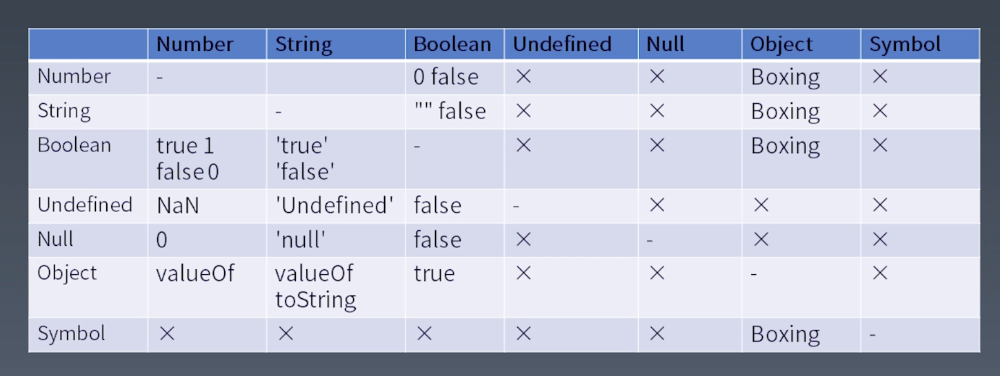

学习笔记

## 运算符和表达式

### 语法树和优先级的关系

优先级更高的运算符会形成更小一级的语法结构也就是子语法树。 （也就是较末一级的结构）

（1） `Member`

__最高优先级__

运算符优先级最高的是 `Member` 运算（类似 `a.b` 这样发的结构）。

1. `a.b`
1. `a[b]`
1. `foo`\`string\`
1. `super.b`
1. `super['b']`
1. `new.target`
1. `new Foo()`


次一级的运算符

1. `new Foo`


（2） Refrence

1. `Object` 
1. `Key` 
1. `delete`
1. `assign`


（3） Call Expressions

1. `foo()`
1. `super()`
1. `foo()[b]` (`Merber` 运算降级为 `Call Expression`)
1. `foo().b` (`Merber` 运算降级为 `Call Expression`)
1. `foo()`\`abc\` (`Merber` 运算降级为 `Call Expression`)

使用产生式来描述优先级更为严谨。

（4） Left Handside & Right Handside Expressions

1. `a.b = c` 其中的 `a.b` 是 `Left Handside Expression` `c` 是 `Right Handside Expressions`

`Right Handside Expressions` 属于 `Left Handside Expression`  反过来不一定成立

只有 `Right Handside Expressions` 能放在等号的左边

（5） Unary Expressions

1. `delete` a.b
1. `void` foo() 可以起到改变语法结构的作用
1. `typeof` a
1. `+` a
1. `-` a
1. `~` a
1. `!` a
1. `await` a

（6） Exponenal

1. `**` 一个右结合的运算符

（7） Multiplitcative 、Addtive 、Shift 、Relationship Expressions

1. Multiplitcative `*` 、 `/` 、 `%`
1. Addtive `+` 、 `-`
1. Shift `<<` 、`>>` 、`>>>`
1. Relationship `<`、`>`、`<=`、`>=` 、`instanceof`、`in`

（8） Equality & Bitwise Expressions

Equality

1. `==`
1. `!=`
1. `===`
1. `!==`

Bitwise

1. `&`、`^`、`|`


## 类型转换




### Unboxing 拆箱转换 （将Object转换成普通类型）

1. ToPermitive
1. toString vs valueOf
1. Symbol.toPrimitive 如果定义了 `Symbol.toPrimitive` 则会忽略 `toString` 和 `valueOf`


`+` 法运算优先调用 `valueOf`

作为属性名使用的时候会优先调用 `toString` 方法


### Boxing 装箱转换

1. Number
1. String
1. Boolean
1. Symbol

前三种使用 new 调用会将值装入一个 Object 对象内

最后一种使用 new Object 调用会将值装入一个 Object 对象内

使用 `==` 比较结果为 `true` 使用 `===` 比较结果为 `false`

当使用 `Member` 去访问属性的时候如果变量是基础变量 则会自动进行装箱转换。

### StringToNumber

```js
function StringToNumber(value){
    if(typeof value !== 'string') return
    if(value.length>=16){
        if(BigInt(value) > BigInt(9007199254740991)){
            return 
        }
        if(BigInt(value) < BigInt(-9007199254740991)){
            return 
        }
    }
   if(value.startsWith('0x')||value.startsWith('0X')){
       return parseInt(value.substring(2),16)
   }
   if(value.startsWith('0o')){
       return parseInt(value.substring(2),8)
   }
   if(value.startsWith('0b')){
       return parseInt(value.substring(2),2)
   }
   return parseFloat(value,10)
```

### NumberToString

```js
function NumberToString(number,system){
    if(Number.isInterger(value) && !Number.isSafeInterger(value)) return
    return value.soString(system)
}
```

## 运行时相关概念

Completion Record

```js
if(x === 1){
    return 10
}
```
js 引擎在解析 if 语句的时候需要知道它完成了之后是怎么完成的 所以需要一个 `Completion Record` 这种数据结构去储存他

包括是否返回以及返回值是啥


Completion Record 分为三个部分

1. type: normal break countinue return or throw
1. value: 基本类型
1. target : label

## 简单语句和复合语句

### 简单语句

1. ExpressionStatement
1. EmptyStatement
1. DebuggerStatement
1. ThrowStatement
1. CountinueStatement
1. BreakStatement
1. returnStatement


### 复合语句

1. BlockStatement
1. IfStatement
1. SwitchStatement (在 C/C++ 里面推荐使用 Switch ， JS内不建议使用)
1. IterationStatement 
1. WithStatement (会带来不确定性 不建议使用)
1. LabelledStatement 
1. TryStatement (TryStatement 不是 BlockStatement finally 一定会被执行，并且括号不能被省略)

BlockStatement 

```js
{
    //
}
```

IterationStatement

```js
while ()

do {} while()

for(;;){}

for(in)

for (of)

for awite(of) 
```

TryStatement

```js
try {

} catch(e){

} finally {

}
```

## 声明

1. FunctionDeclaration
1. GeneratorDecaration
1. AsyncFunctionDecaration
1. AsyncGeneratorDecaration
1. VariableStatement
1. CalssDecaration
1. LexicalDeclaration

### 只认fucntion body 的声明
（变量声明提升和函数声明提升）
1. function
1. function *
1. async function
1. async function *
1. var

### 当在声明前使用时会报错的声明
(存在暂存性死区)
1. calss
1. const
1. let 


### 作用域

新标准：

`{}`产生一个作用域

## JS 结构化｜宏任务和微任务

### JS 执行粒度

1. 宏任务 （传给JS引擎的任务)
1. 微任务（Promise）（JS引擎内部的任务）
1. 函数调用 (Excution Context)
1. 语句/声明 (Completion Record)
1. 表达式 (Reference)
1. 直接量/变量/this


JS 引擎是一个静态库

### 事件循环 Event Loop

wait -> get code -> execute -> wait

等待一个锁

```Object-C
while(true){
    char source[1024];
    printf("js:>");
    fgets(source,1024,stdin);
    result = [context evaluateScript:NSString stringWithUTF8Dtring:source]];
    NSLOG(@"%@",result);
}
```

## JS结构化 ｜ JS函数调用

foo.js
```js
function foo(){
    console.log(i)
}
export foo
```

index.js
```js
import {foo} from 'foo.js'
var i = 0
console.log(i)
foo()
console.log(i)
i++
```

上文 index.js `foo` 访问的 `i` 并不是 index.js 中的 `i` 而是 foo.js 中的 `i`

`执行环境栈形成了作用域和作用域链`


Excution Context 

1. code evalution state
1. Function
1. Script or Module
1. Generator
1. Realm
1. LexicalEnvironment
1. VariableEnvironment

LexicalEnvironment

1. this
1. new.target
1. super
1. 变量

VariableEnvironment

历史包袱 给 var 服务


Environment Record   

Environment Records

1. Declarative Environment Records
1. Global Environment Records （只有一个）
1. Object Environment Records （给with用的）

Declarative Environment Records

1. Function Environment Records
1. Module Environment Records


### Function-Closure

每一个函数都会生成一个闭包

闭包:

1. 代码 
1. 环境 (Object 和 变量和序列组成)

每个函数都会带一个定义时生成的 Environment Records 存在自生一个属性上

### Realm

在JS中，函数表达式和对象直接量均会创建对象。

使用.做隐式转换也会常见对象

这些对象也是有原型的，如果我们没有Realm，我们就不知道他们的原型是什么。


